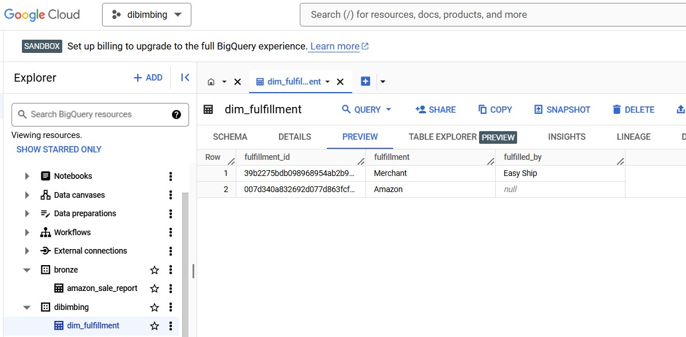
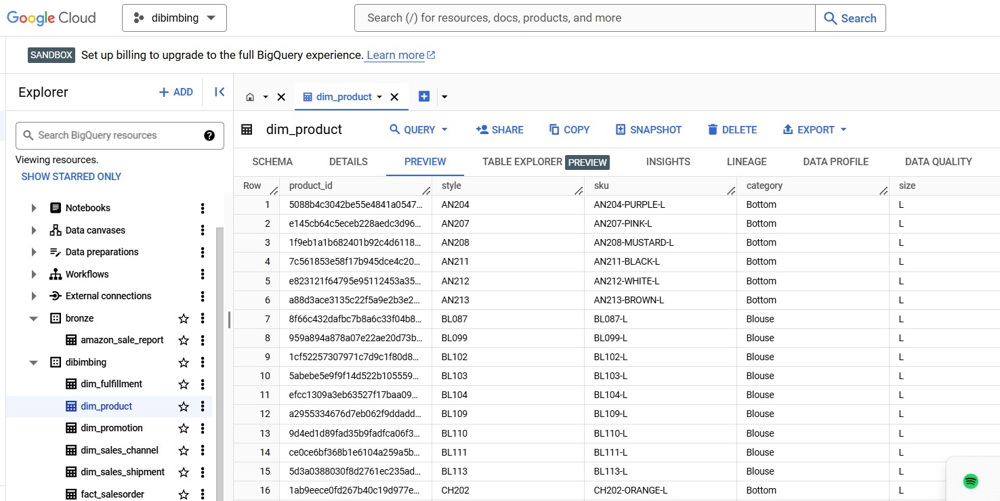
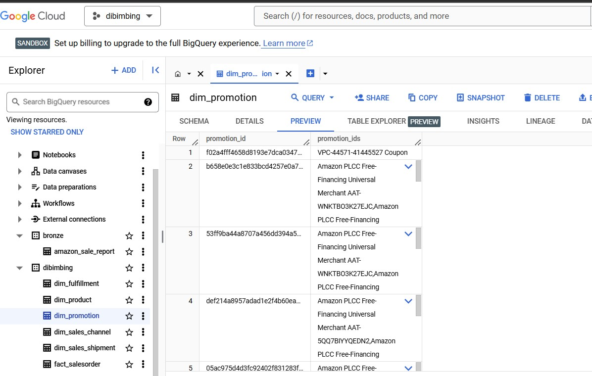
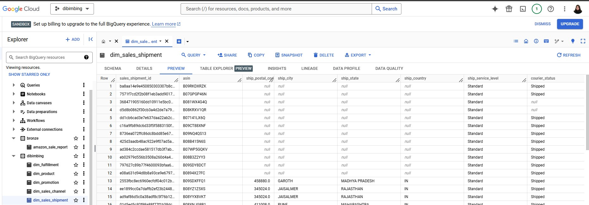
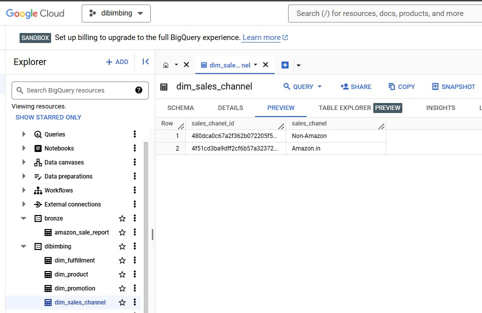
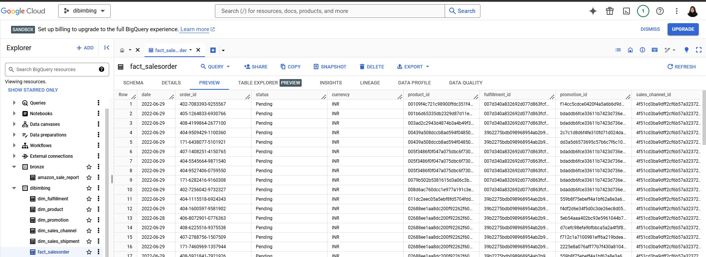
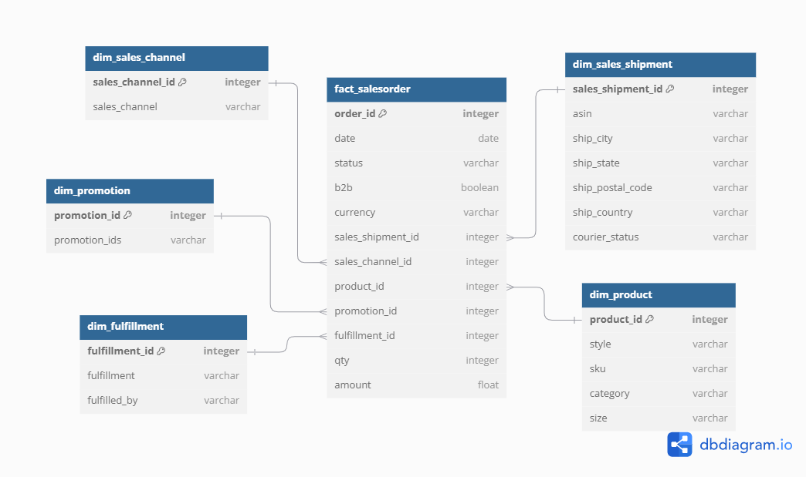
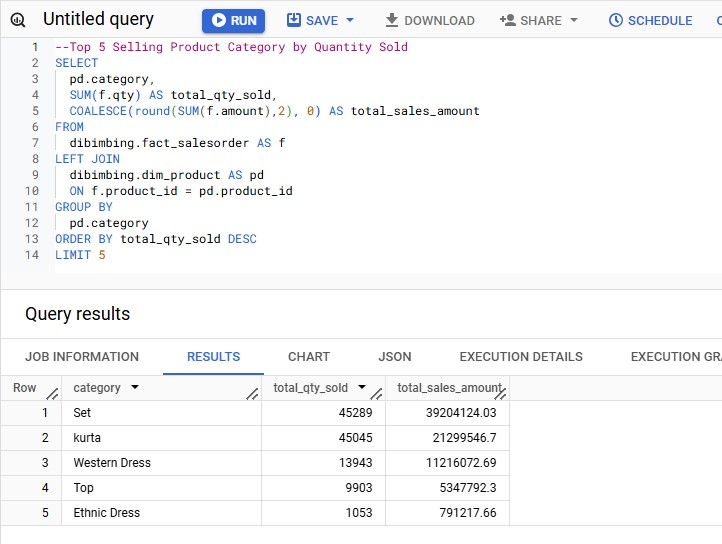
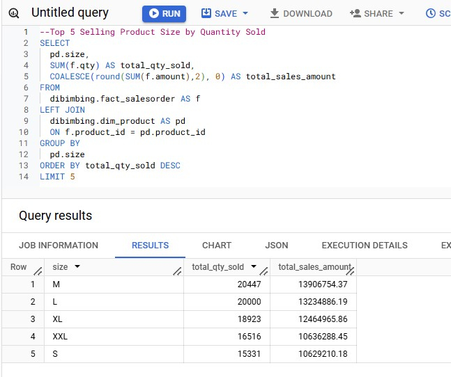
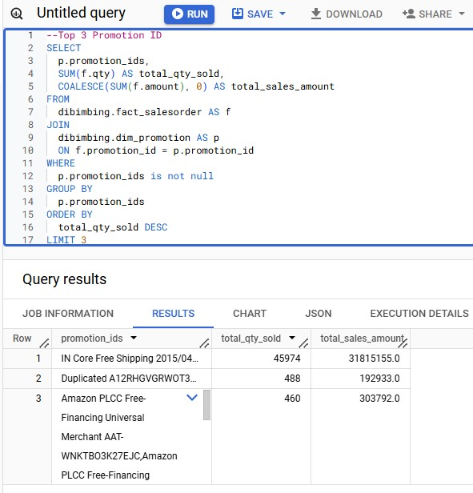

# DBT Project - Star Schema for E-commerce Sales Data

This repository contains a Data Build Tool (DBT) project designed to build a star schema model for an e-commerce sales dataset. The goal of this exercise is to create a star schema by building dimension tables and a fact table to support data analysis and reporting.

## Objective

In this exercise, we will design and implement a Star Schema based on Kimball’s Data Modeling methodology using an Amazon sales dataset. We will create dimension tables, a fact table, and an ERD to support business reporting and analytics needs.

## Exercise Breakdown

1. **Upload the data into BigQuery Table**  
   First, we need to upload the provided e-commerce sales data into BigQuery, which will be used to create the necessary tables.

2. **Build Table dim_fulfillment using DBT**  
   Create a dimension table `dim_fulfilment` to represent fulfillment data, including the fulfillment method and fulfillment partner.

3. **Build Table dim_product using DBT**  
   Create a dimension table `dim_product` containing information about the products such as SKU, style, category, and size.

4. **Build Table dim_promotion using DBT**  
   Create a dimension table `dim_promotion` to store data about promotions related to the sales.

5. **Build Table dim_sales_shipment using DBT**  
   Create a dimension table `dim_sales_shipment` to capture shipping information, including postal codes, city, state, country, and service level.

6. **Build Table dim_sales_channel using DBT**  
   Create a dimension table `dim_sales_channel` to store data about the sales channels through which the products are sold.

7. **Build Table fact_salesorder using DBT**  
   The fact table `fact_salesorder` will be built to aggregate key sales metrics, linking the dimension tables created earlier.

8. **Create an ERD for the Star Schema**  
   Design and document an Entity Relationship Diagram (ERD) for the star schema, including all dimension tables and the fact table.

9. **Create an Analysis using Star Schema**  
   Develop an analysis based on the star schema model, such as identifying the top-selling products by category, size, and promotion_id

**Top 5 Selling Product Category**

From the result, we can see that **Set** category leads both in quantity sold (45,289 units) and total sales amount ($39,204,124.03), indicating its broad appeal and high demand. Following closely is the **Kurta** category with 45,045 units sold and $21,299,546.70 in sales, suggesting it is also a popular choice among customers. Categories such as **Western Dress**, **Top**, and **Ethnic Dress** show lower sales volumes, with the Western Dress category performing reasonably well in terms of sales amount despite the lower quantity sold. This could imply that these categories have a higher price per unit. The Top and Ethnic Dress categories, while having smaller volumes, may cater to niche markets or higher-end segments. 

**Top 5 Selling Product Size**

We can see that **M, L, and XL are the most popular sizes**, contributing the most to both quantity sold and total sales revenue. These sizes should be prioritized in inventory management to meet customer demand and avoid stockouts. Larger sizes like L and XL not only have high demand but also generate significant sales, suggesting the potential for higher prices or premium offerings. Smaller sizes (S) and larger sizes (XXL) also sell well but with lower sales amounts, indicating a potential opportunity to adjust pricing or promotions to increase their sales.

**Top 3 Promotion ID**

From the result, we can see that the "IN Core Free Shipping 2015/04/08 23-48-5-108" promotion is by far the most successful, contributing the highest total quantity sold (45,974 units) and total sales amount (over 31 million). This promotion likely focused on offering free shipping, which can significantly drive sales volume. The second most successful promotion, "Duplicated A12RHGVGRWOT3S 1560498941486", generated fewer sales (488 units) but still contributed a meaningful amount to revenue. The third promotion, which includes multiple free-financing offers for Amazon PLCC, had a smaller sales volume (460 units), but still generated over 300k in revenue. These insights suggest that **offering attractive shipping deals or flexible financing options can drive substantial sales**, while also highlighting that **some promotions may not see as high a volume, but still contribute to significant revenue**.